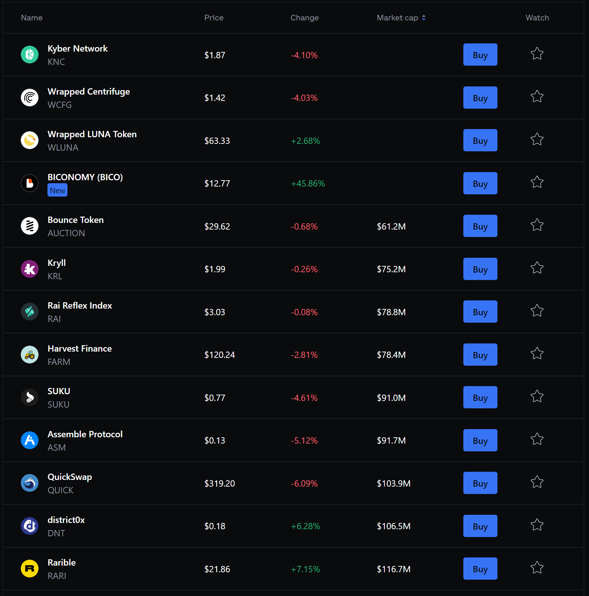
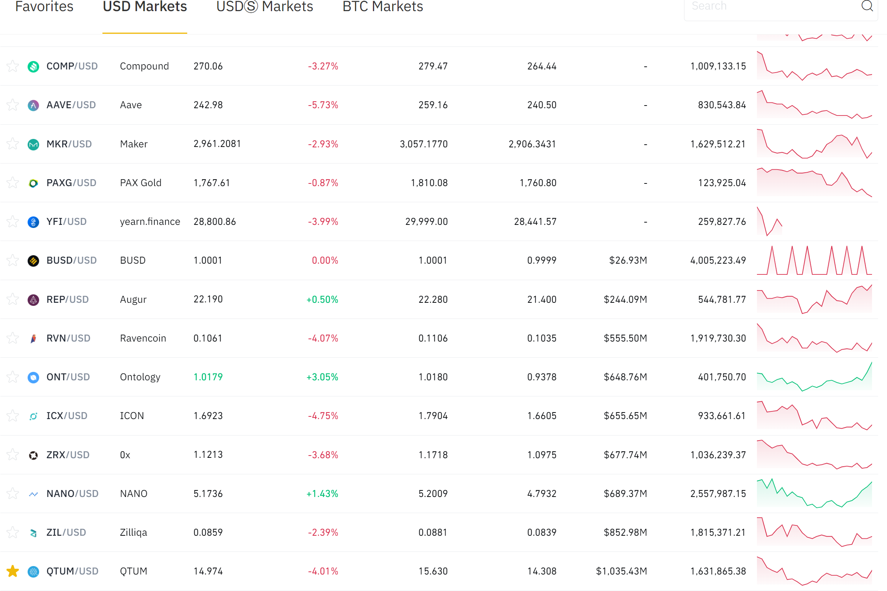

Title: Alt Coins
Lead: Finding Potential Alternative Coins
Published: 12/02/2021
Tags:
  - crypto
  - invest
---
### What are Alt Coins?
By Alt Coins I refer to the coins that are,
- not main stream
- might still be in early stage
- has potential as it brings someting new to the table

For example, ETH, ADA, DOGE etc are not alt coins. These are already well known coins.

### Sources
**Popular Exchanges**

Tentatively, most stable alt coins can be found at,
- coinbase
- binance.us *
- kraken
- venmo
- crypto app

**Coin Trackers*
- coinmarketcap
- reddit - crypto moonshot
- telegram - numerous crypto groups

**news source**
yet to draft..

**Coinbase**
We surf [coinbase.com/trade](https://www.coinbase.com/trade) and sort them in ascending order of Market Cap. That gives us list of established alt coins. Here's a screenshot from today,

There's your potential alt coins. Please note that, coinbase is more toward mainstream, more stable. You find less risky alt coins here and hence less growth, mostly.

**Binance US**
Similarly, we surf [binance.us/en/markets](https://www.binance.us/en/markets) and sort them in ascending order of Market Cap. That gives us list of established alt coins. Here's a screenshot today,

\* _I don't have access to international binance, hence, I mention US product_

**coinmarketcap**
Surfing [coinmarketcap.com/new](https://coinmarketcap.com/new) we are able to find even riskier, potential trendy coins. Reserach and invest on your own risk.

### References

_Not an investment advice. Opions are personal, don't represent my employer._